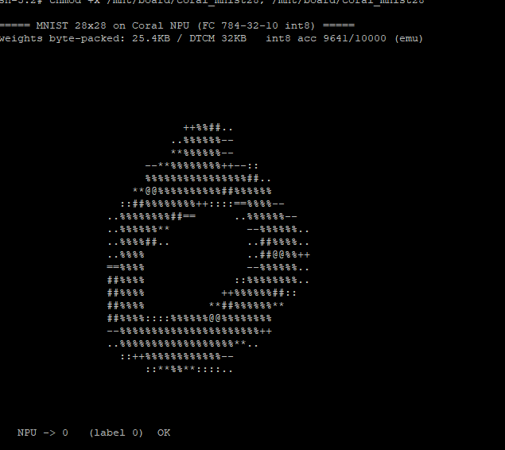
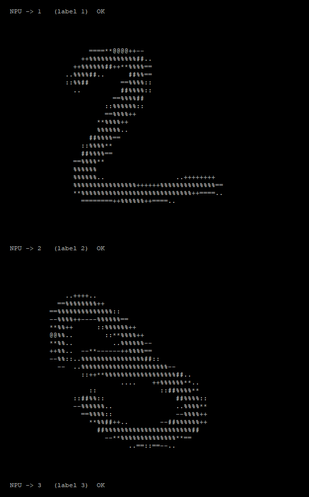
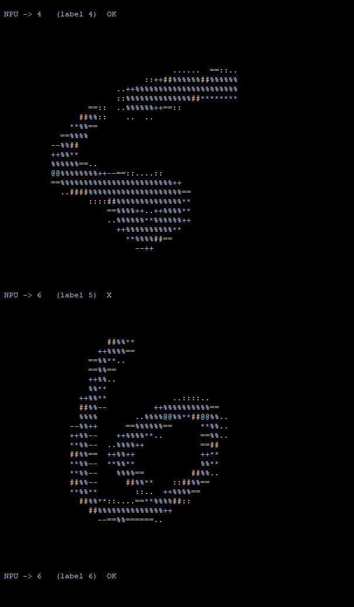
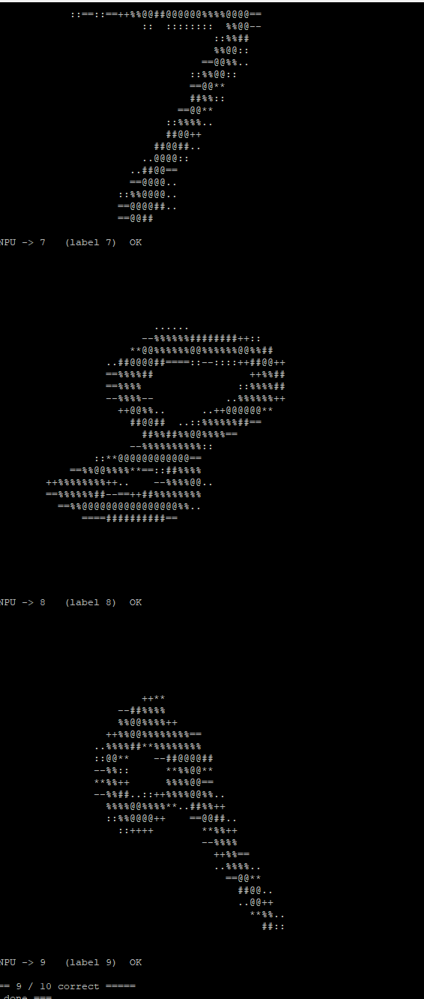

# 리눅스에서 Coral NPU 추론 성공 (2026-08-13)

PetaLinux 2026.1 위에서 `/dev/mem` 으로 Coral NPU를 구동해 MNIST 28×28 추론.
**베어메탈 결과와 오답까지 완전히 일치.**

## 결과

```
===== MNIST 28x28 on Coral NPU (FC 784-32-10 int8) =====
weights byte-packed: 25.4KB / DTCM 32KB   int8 acc 9641/10000 (emu)

  NPU -> 0   (label 0)  OK
  NPU -> 1   (label 1)  OK
  NPU -> 2   (label 2)  OK
  NPU -> 3   (label 3)  OK
  NPU -> 4   (label 4)  OK
  NPU -> 6   (label 5)  X      <- 유일한 오답
  NPU -> 6   (label 6)  OK
  NPU -> 7   (label 7)  OK
  NPU -> 8   (label 8)  OK
  NPU -> 9   (label 9)  OK
===== 9 / 10 correct =====
=== done ===
```


## 캡처 화면

| | |
|---|---|
|  |  |
|  |  |

마지막 장에 `===== 9 / 10 correct =====` 와 유일한 오답 `NPU -> 6 (label 5) X` 가 보인다.

## 검증 경로 네 가지가 모두 일치

| 경로 | 실행 위치 | 결과 |
|---|---|---|
| numpy 정수 시뮬 | PC | 9641 / 10000 |
| unicorn 에뮬레이터 | PC | 로짓까지 비트 일치 |
| 베어메탈 (2026-07-28) | 실제 보드 | 9 / 10, 오답 5→6 |
| **리눅스 (2026-08-13)** | **실제 보드** | **9 / 10, 오답 5→6** |

오답의 내용까지 같다는 것은 계산 경로 전체가 일치한다는 뜻이다.
배선·타이밍·양자화 중 하나라도 어긋났다면 틀리는 방식이 달랐을 것이다.

## 여기까지 오는 데 걸렸던 것들

리눅스에서 PL에 접근하려면 세 가지를 모두 넘어야 했다.

| # | 증상 | 원인 | 대응 |
|---|---|---|---|
| 1 | 부팅 직후 커널 패닉 | 2019.1 프리빌트 FSBL이 우리 XSA와 불일치 | PetaLinux 2026.1로 부팅 5종 일괄 생성 |
| 2 | NPU 접근 시 보드 완전 정지 | 커널이 미사용 클럭을 자동 차단 (`clk_disable_unused`) | 부팅옵션 `clk_ignore_unused` |
| 3 | 여전히 SError | 커널이 미사용 전원 도메인을 자동 차단 | 부팅옵션 `pd_ignore_unused` |
| 4 | `coral_probe` 만 패닉 | CSR `+0x30008`(status) 읽기가 응답 없음 | 로더는 CSR `+0x0/+0x4` 만 쓰므로 무관 |

## 실측으로 확인한 주소 지도

읽기 전용 탐침(`rdprobe`)으로 응답 경계를 측정한 결과가 코어 사양과 정확히 일치했다.

```
0x5_0000_0000 + 0x0000   READ OK      ITCM 시작
0x5_0000_0000 + 0x2000   BUS ERROR    ITCM 8KB 끝
0x5_0000_0000 + 0x10000  READ OK      DTCM 시작
0x5_0000_0000 + 0x18000  BUS ERROR    DTCM 32KB 끝
0x5_0000_0000 + 0x30000  READ OK      CSR (offset 0)
```

## 재현 절차

1. SD에 `09_remote/sd_linux/` 의 BOOT.BIN, image.ub, boot.scr + `board/` 폴더
2. u-boot 프롬프트에서
   ```
   setenv bootargs "console=ttyPS0,115200 clk_ignore_unused pd_ignore_unused rdinit=/bin/sh root=/dev/ram0 rw"
   load mmc 0:1 0x10000000 image.ub
   bootm 0x10000000
   ```
3. ```
   mount -t proc proc /proc; mount -t sysfs sys /sys; mount -t devtmpfs dev /dev; mount -t vfat /dev/mmcblk0p1 /mnt
   /mnt/board/coral_mnist28
   ```

※ 위 부팅옵션을 이미지에 구워 넣는 작업은 아직 남아 있다 (`fix_linux.sh`).
